# Fast Patch-based Style Transfer of Arbitrary Style

**基于patch的随意风格的风格迁移**
----

----

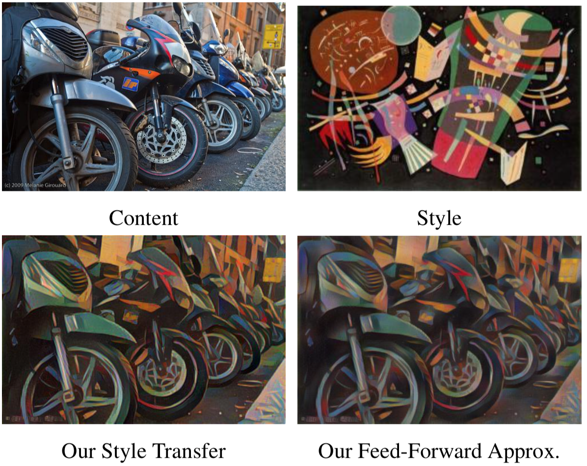</img>

## “风格”

艺术风格的模糊概念很难被量化地捕捉。      

- 早期作品使用相似性度量或基于像素值的局部统计定义样式。   
- 然而，最近实现令人印象深刻的视觉质量的方法来自使用 **卷积神经网络** (CNN) 进行特征提取。这些方法的成功甚至为移动应用程序创造了一个市场，可以按需对用户提供的图像进行样式化。

## “迁移”

仍然是一个复杂的优化过程        
目前的加速方法： 使用预训练的权重 （牺牲了多样性，因为预训练的权重无法包含超出训练集以外的风格）

## 现有方法   
要么应用 (i) 适用于任何样式图像但代价很高的优化过程   
要么应用 (ii) 经过训练的有限样式的较为高效的前馈网络    

existing applications are either  **time-consuming** or **limited in the number of provided styles**, depending on the method of style transfer.

## related work

* Style Transfer as Optimization

        速度慢 但是可以允许任意样式的风格迁移

* 基于前馈风格网络

        速度快 但是这些方法需要针对每个新风格重新训练

* 视频风格迁移

        temporal loss function    

        Their loss function relies on optical flow algorithms for gluing the style in place across nearby frames.
        它们的丢失函数依赖于光流算法, 以便在附近的帧中粘合现有的样式。

....

* Inverting Deep Representations

## In this work

基于布丁（patch）级别的操作        
每一层对应一个激活区域

### “swapping the style”

***内容图像被样式图像逐个替换***

使 C 和 S 分别表示 内容(content) 和 样式(style) 图像的 RGB 相关区域,使 𝜱(·) 是预训练的 CNN 的完全卷积部分表示的函数,该部分将图像从 RGB 映射到某些中间激活空间。计算激活 𝜱(C) 和 𝜱(S) 后,样式交换过程如下所示:

1. 提取一组内容和样式激活的补丁,由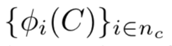</img>和 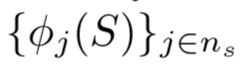</img>  表示,其中 nc 和 ns 是提取的补丁数。提取的补丁应具有足够的重叠度，并包含激活的所有通道。

2. 对于每个内容激活补丁区域,根据 规范化（normalized） 的 交叉关联系数 来确定最接近匹配的风格补丁       
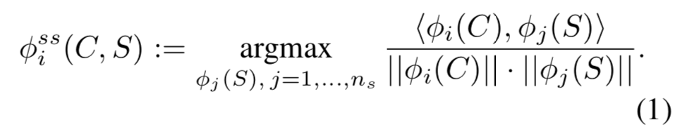</img>

3. 将每个内容激活补丁区域 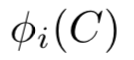</img>  与其最接近匹配的内容激活补丁 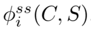</img> 进行交换（swap）。

4. 通过平均由于步骤 3 而可能具有不同值的重叠区域,重建完整的内容激活区域(我们用 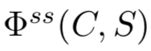</img> 表示)。

此操作将导致 将与具有内容图像结构的单个图像相对应的激活区域隐藏，同时从样式图像中获取纹理。

---- 

- 样式交换操作的插图   
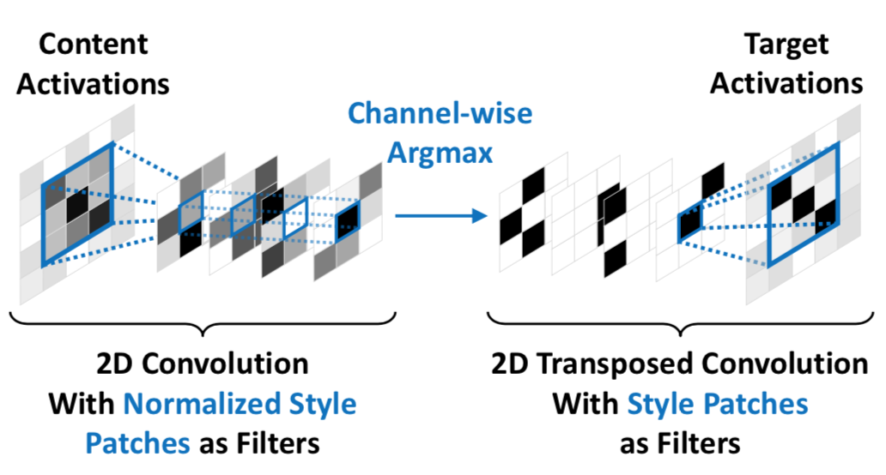</img>
2D 卷积提取大小 3* 3 和步长 1 的补丁,并计算正则化的交叉关联系数。     
在channel-wise argmax 操作之前和之后,有 nc = 9 个空间位置和 ns = 4 个特征通道。      
2D 转置卷积通过将每个最佳匹配样式补丁放置在相应的空间位置来重建图片。

---- 

### 并行实现

通过一个有着3个功能模块的网络来实现：    

（i）一个二维卷积层      
（ii）channel-wise argmax       
（iii）一个二维卷积层（用于重新构建）  

因为**内容激活区域补丁**（content activation patch）的正则化项 和 argmax 操作保持不变  
故改写
</img>
为
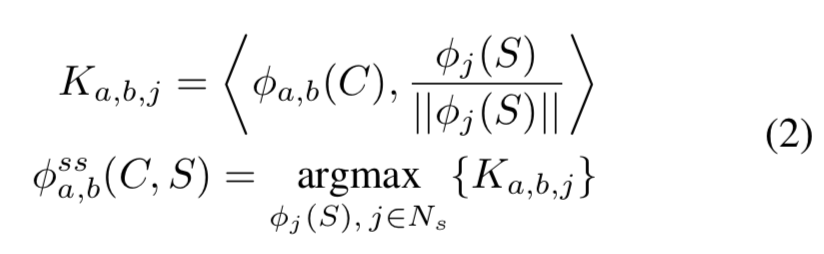</img>

K 可以通过使用 **正则化的风格补丁** 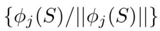</img> 作为滤波器的二维卷积网络来计算，而内容补丁则作为网络的输入。 

而计算出的 K 具有 nc （空间位置）和 ns （特征通道）。在每个空间位置，Ka、b 是一个内容激活patch（输入）和所有样式激活patch之间的交叉关联系数的向量。

为了给2D迁移卷积层准备输入，我们将 Ka,b 替换为独热编码向量 K'。  
以挑选出最匹配的风格激活patch。

构造 </img> 的最后一个操作是 2D 转换卷积，其中 K' 作为输入，**非正则化风格激活patch**作为filter。   
在每个空间位置，输出中仅包含最佳匹配样式激活修补程序，因为其他修补程序乘以零。

- NOTE：在转换卷积中，会将重叠部分相加，并且为了平均这些值，我们按重叠补丁数对输出的每个空间位置执行元素划分。

### 优化目标

使用平方差作为loss

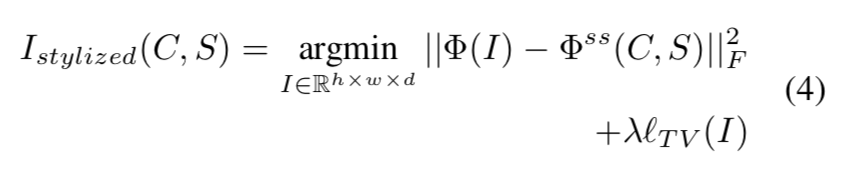</img>

- NOTE:
    + LTV: total variation regularization: 全变差正则化，使用此项来对图像重新上采样的结果进行平滑，其算法如下：
    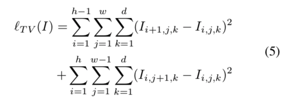</img>

    + </img>: 完整的内容激活区域

### 反向网络

通过使用另外的神经网络逼近最优值来提升优化速度。
一旦这个网络被训练，它将可以用快的多的速度进行风格迁移，我们也将着重训练这个网络，从而使其能够适应新的风格和内容图片。
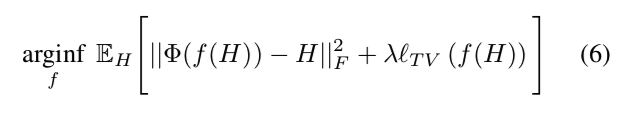</img>

- NOTE:
    + 函数f：确定的函数
    + H：一个随机变量用以代表目标激活区域
    + 全变差正则化项的作用同4一样

#### 训练逆向网络

##### 非注入
使用一个参数神经网络来作为逆向卷积网络的代替品：
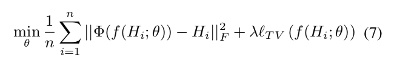</img>

##### 非推定
训练时使用一对一对的训练集进行训练（图像对应其风格迁移后的图像）

#### 前馈过程包括以下步骤
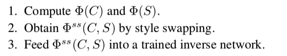</img>

1 通过卷积网络获得 内容图 和 风格图 相应的结果      
2 通过风格互换构建完整的激活区域   
3 将激活区域放入训练好的逆向网络   

本文章采用的方法将比现有方法是用更少次的迭代。

通过调整patch size来改变

## 逆向网络的训练

将VGG-19从 input layer 删减到了 “Relu3_1”

### 数据集：COCO + wikiart.org（kaggle）

每个数据集都分别有大约 80000 个自然图片和画作。

### 训练

将每个图像大小调整为 250 x 250 像素

再每个数据集上训练2个epoch

每个 minibatch 使用 2个自然图像和 2个画作图像

每个 minibatch 通过 使用4个风格转换过的 activation （两个natural image 用两个 style image进行风格交换）被增强

variance regularization coefficient 十的负6次方

优化器是 adam 学习率为 10的-3次方

# 可改进

lack of a global style measurement

lack of a similarity measure for neighboring patches, both in the spatial domain and the temporal domain

这些简化会牺牲质量来提高效率,但当应用于逐帧视频时,可能会偶尔导致局部闪烁效果。在保持算法的高效性和通用性的同时,最好寻找提高质量的方法。

