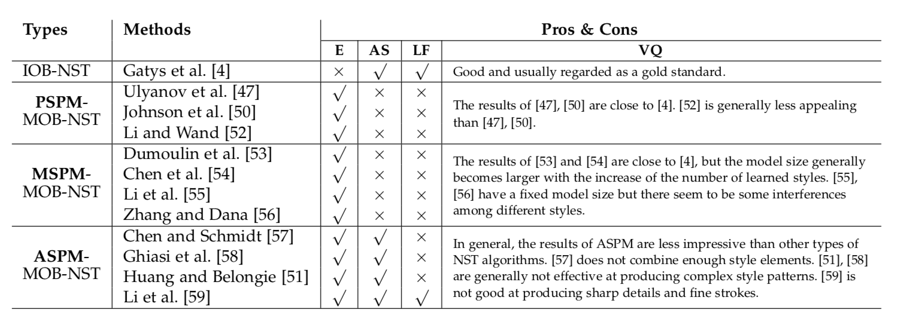

# 神经风格迁移：综述

对目前的风格迁移算法进行综述（截止2018年3月）

[有关文章、代码、预训练的模型、比较结果](https://github.com/ycjing/Neural-Style-Transfer-Papers)

Gatys等人的工作开辟了一个称为神经风格转移（NST）的新领域，即利用卷积神经网络以不同样式渲染内容图像的过程。

-----  

## 分类


</img>

----

## 1.风格迁移（无神经网络）

- non-photorealistic rendering(NPR)  非真实渲染

- image-based artistic rendering（IB-AR）基于图像的艺术渲染

    ***P. Rosin and J. Collomosse, Image and video-based artistic stylisation. Springer Science & Business Media, 2012, vol. 42.***

    ***J. E. Kyprianidis, J. Collomosse, T. Wang, and T. Isenberg, “State of the ‘art’: A taxonomy of artistic stylization techniques for images and video,” IEEE transactions on visualization and computer graphics, vol. 19, no. 5, pp. 866–885, 2013.***

    ***A. Semmo, T. Isenberg, and J. Do ̈llner, “Neural style transfer: A paradigm shift for image-based artistic rendering?” in Proceedings of the Symposium on Non-Photorealistic Animation and Rendering. ACM, 2017, pp. 5:1–5:13***

#### 主要方法

- Stroke-Based Rendering（SBR）基于笔触的渲染

    只能使用特定风格渲染图片 不灵活

    ***A. Hertzmann, “Painterly rendering with curved brush strokes of multiple sizes,” in Proceedings of the 25th annual conference on Computer graphics and interactive techniques. ACM, 1998, pp. 453– 460.***

- Region-Based Techniques 基于区域的方法

    早期基于区域的 IB-AR 算法利用区域的形状来指导笔画放置，通过这种方式，可以在图像的不同语义重分中生成不同的笔画模式。

    ***A. Kolliopoulos, “Image segmentation for stylized non- photorealistic rendering and animation,” Ph.D. dissertation, Uni- versity of Toronto, 2005.***

    ***B. Gooch, G. Coombe, and P. Shirley, “Artistic vision: painterly rendering using computer vision techniques,” in Proceedings of the 2nd international symposium on Non-photorealistic animation and rendering. ACM, 2002, pp. 83–ff.***

    song等人进一步提出了一种基于区域的IB-AR算法，以操纵几何艺术风格。他们的算法通过用多个规范形状替换区域来创建简化的形状渲染效果。

    ***Y.-Z. Song, P. L. Rosin, P. M. Hall, and J. Collomosse, “Arty shapes,” in Proceedings of the Fourth Eurographics conference on Computational Aesthetics in Graphics, Visualization and Imaging. Eurographics Association, 2008, pp. 65–72.***

    依然无法模拟任意样式。

- Example-Based Rendering 基于样例的渲染

    图像类比旨在以监督学习的方式学习一对未经风格迁移的原图像和相关的经过风格迁移的图像。训练集包括一对未风格化的源图像和具有特定样式的风格化后的图像。

    在训练过程中，学习类似变换，并在给定测试输入照片时创建类似的程式化结果。

    ***A. Hertzmann, C. E. Jacobs, N. Oliver, B. Curless, and D. H. Salesin, “Image analogies,” in Proceedings of the 28th annual confer- ence on Computer graphics and interactive techniques. ACM, 2001, pp. 327–340.***

    仅利用低级图像特征，无法有效地捕获内容和样式。

- Image Processing and Filtering 图像处理与滤波

    利用双边滤波和高斯滤波产生卡通效果

    ***H. Winnemo ̈ller, S. C. Olsen, and B. Gooch, “Real-time video abstraction,” in ACM Transactions On Graphics (TOG), vol. 25, no. 3. ACM, 2006, pp. 1221–1226.***

    ***C. Tomasi and R. Manduchi, “Bilateral filtering for gray and color images,” in Proceedings of the IEEE International Conference on Computer Vision. IEEE, 1998, pp. 839–846.***

    ***B. Gooch, E. Reinhard, and A. Gooch, “Human facial illustrations: Creation and psychophysical evaluation,” ACM Transactions on Graphics, vol. 23, no. 1, pp. 27–44, 2004.***

    更易实现、性能高效、而在多样性方面比较有限。

### 综上

    基于上述讨论，虽然一些没有CNN的IB-AR算法能够忠实地描述某些规定的样式，

    但它们在灵活性、样式多样性和有效的图像结构提取方面通常有局限性。

    因此，需要新的算法来解决这些限制，从而产生了NST领域。

----

## 2.神经网络风格迁移前导 DERIVATIONS OF NEURAL STYLE TRANSFER

#### 如何对图像进行建模和风格提取       

风格与纹理非常相关，故可以借鉴视觉纹理建模。

```
风格（style）与纹理（texture）的概念非常相关，然而并不限于纹理。

风格还涉及大量的简化和图形抽象。（纹理特征的合成或对齐）
```

***L.-Y. Wei, S. Lefebvre, V. Kwatra, and G. Turk, “State of the art in example-based texture synthesis,” in Eurographics 2009, State of the Art Report, EG-STAR. Eurographics Association, 2009, pp. 93–117.***

***A. A. Efros and T. K. Leung, “Texture synthesis by non- parametric sampling,” in Proceedings of the IEEE International Conference on Computer Vision, vol. 2. IEEE, 1999, pp. 1033–1038.***

***L.-Y. Wei and M. Levoy, “Fast texture synthesis using tree- structured vector quantization,” in Proceedings of the 27th annual conference on Computer graphics and interactive techniques. ACM Press/Addison-Wesley Publishing Co., 2000, pp. 479–488.***

    有两种不同的方法来建模视觉纹理

- 摘要统计进行参数纹理建模
    + gram-based 基于格拉姆矩阵(卷积网络)
        * 获取纹理的gram矩阵表示的方法
        </img>

            - $\cal{F}^l(\mit{I}_s)$ 是在预训练的网络中第 $l$ 层的 feature map（特征图）

            - $\cal{F}^l(\mit{I}_s)^{'}$ 是 $\cal{F}^l(\mit{I}_s)$ 降维之后的表示 (C * W * H) =>(C * (W*H))

            Gatys 提出的一种较新的参数纹理建模方法，是首次使用CNN测量汇总统计数据的方法（VGG）。

            统计全局的数据，然而对于长距离对称数据的识别效果不好。     

        ***L. A. Gatys, A. S. Ecker, and M. Bethge, “Texture synthesis using convolutional neural networks,” in Advances in Neural Information Processing Systems, 2015, pp. 262–270.***

        ***K. Simonyan and A. Zisserman, “Very deep convolutional networks for large-scale image recognition,” arXiv preprint arXiv:1409.1556, 2014.***

        为了解决之前的问题，Berger 和 Memisevic 水平和垂直地转换feature map，
        即将(i,j)、(i+x,j)、(i,j+x)相关联，从而包含空间排列信息，因此在对具有对称属性的纹理建模时更为有效。

        ***G. Berger and R. Memisevic, “Incorporating long-range consis- tency in cnn-based texture generation,” in International Conference on Learning Representations, 2017.***

- 马尔科夫随机场 （MRFs） 进行非参数纹理建模。
    + 其他值得注意的纹理建模方法是使用非参数重采样。各种非参数方法都基于 MRFs 模型，该模型假定在纹理图像中，每个像素完全以其空间邻域为特征。


#### 如何在保留内容的同时重建具有所需风格信息的图像

通常，许多视觉任务的基本步骤是从输入图像中提取抽象表示形式。
图像重建是一个反向过程，就是从提取的图像表示法中重建整个输入图像。

已经有一些特定的图像表示形式，并从抽象表示形式中分析出包含哪些信息。
在这里，我们主要关注基于 CNN 表示的图像重建算法，这些算法可分为基于图像优化的在线图像重建 （Image-Optimisation-Based Online Image Reconstruction  IOB-IR） 和基于模型优化的离线图像重建 （Model-Optimisation- Based Offline Image Reconstruction  MOB-IR）。

- 基于图像优化的在线图像重建 IOB-IR
    + 反转CNN
        * 从随机噪声开始，在图像空间中使用算法迭代优化，直到它在相关的期望上收敛，因此该过程是耗时的。

        ***A. Mahendran and A. Vedaldi, “Understanding deep image representations by inverting them,” in Proceedings of the IEEE Conference on Computer Vision and Pattern Recognition, 2015, pp. 5188–5196.***

        ***——, “Visualizing deep convolutional neural networks using natural pre-images,” International Journal of Computer Vision, vol. 120, no. 3, pp. 233–255, 2016.***


- 基于模型优化的离线图像重建 MOB-IR
    + 预训练的前馈网络
        为了解决效率问题，Dosovitskiy和Brox提出提前训练前馈网络并将计算负担置于训练阶段。 在测试阶段，可以通过网络前向传递简单地完成相反的过程。他们的算法显着加快了图像重建过程。

        ***A. Dosovitskiy and T. Brox, “Inverting visual representations with convolutional networks,” in Proceedings of the IEEE Confer- ence on Computer Vision and Pattern Recognition, 2016, pp. 4829– 4837.***

        在他们后来的工作中，他们使用了对抗网络（GAN）来改进结果。

        ***——, “Generating images with perceptual similarity metrics based on deep networks,” in Advances in Neural Information Processing Systems, 2016, pp. 658–666.***

        ***I. Goodfellow, J. Pouget-Abadie, M. Mirza, B. Xu, D. Warde- Farley, S. Ozair, A. Courville, and Y. Bengio, “Generative adver- sarial nets,” in Advances in neural information processing systems, 2014, pp. 2672–2680.***

---

## 3.神经网络风格迁移算法的分类 （A TAXONOMY OF NEURAL STYLE TRANSFER ALGORITHMS）

在这里，我们尝试以更加结构化的方式评估这些算法，只关注细节，语义，深度和笔触的变化

#### NST算法：

- Image-Optimisation-Based Online Neural Methods

- Model-Optimisation-Based Offline Neural Methods

#### Image-Optimisation-Based Online Neural Methods

DeepDream is the first attempt to produce artistic images by reversing CNN representations with IOB-IR techniques.

DeepDream 是第一个尝试通过使用 IOB-IR（Image-Optimisation-Based Online Image Reconstruction） 技术反转CNN来产生艺术图像的。

***A. Mordvintsev, C. Olah, and M. Tyka, “Incep- tionism: Going deeper into neural networks,” 2015. [Online]. Available: https://research.googleblog.com/2015/06/ inceptionism- going- deeper- into- neural.html***

通过进一步将视觉纹理建模技术与模型风格相结合，随后提出了IOB-NST算法，为NST领域奠定了早期基础。

- 基本思想  

```
首先从相应的样式和内容图像中建模和提取样式和内容信息，将它们重新组合为目标表示，
然后迭代地重建与目标表示匹配的程式化结果。
```

通常，不同的IOB-NST算法共享相同的IOB-IR技术，但它们对视觉样式进行建模的方式不同，视觉样式建立在前面提到的两类视觉纹理建模技术之上。

IOB-NST算法的共同缺陷是由于迭代图像优化过程，它们在计算上是耗时的。


1. 具有摘要统计的参数神经方法（Parametric Neural Methods with Summary Statistics）


    - Gatys等人：

        ## ***[4] L. A. Gatys, A. S. Ecker, and M. Bethge, “Image style transfer using convolutional neural networks,” in Proceedings of the IEEE Conference on Computer Vision and Pattern Recognition, 2016, pp. 2414–2423.***

        ***L. A. Gatys, A. S. Ecker, and M. Bethge, “A neural algorithm of artistic style,” ArXiv e-prints, Aug. 2015.***

        通过重建VGG-19网络中间层，Gatys等人观察到深度卷积神经网络能够从任意照片中提取内容，并且可以从著名艺术品中提取图像的一些外观信息。

        根据此，他们构建了一个惩罚算法来通过从 内容和风格化图片中高级抽象部分的不同 来构建新的风格图片的内容组件。

        并且通过匹配 基于矩阵的风格摘要统计信息 和 风格化的图片 来构造风格组件。

        这些摘要统计信息源自他们提出的纹理建模技术

        ***L. A. Gatys, A. S. Ecker, and M. Bethge, “Texture synthesis using convolutional neural networks,” in Advances in Neural Information Processing Systems, 2015, pp. 262–270.***

        - 方法细节

            给定一个内容图 $I_c$ 和一个风格图 $I_s$ ，[4]中的算法试图去寻找一个风格化的图像 $I$ 以符合以下要求：

            ## $I^* = arg_{I} min \cal {L}_{total} (\mit{I}_c, I_s, I)$

            ## $=arg_{I} min {\alpha} \cal{L}_c(\mit{I}_c, I) + {\beta} {\cal{L}}_{s} (\mit{I}_s, I)$


            * 其中 $\cal{L}_c$ 是比较 给定内容图 和 风格化图片 的内容

                + 损失函数 $\cal{L}_c$ 定义：

                    ##### $\cal{L}_c = \sum_{l \in {\{l_c\}}} || \cal{F}^l(\mit{I}_c)-\cal{F}^l(\mit{I})||^\tt2$

                    - $\{l_c\}$ 表示用来计算损失的 VGG 网络的层的集合

                    - 实际上 是在卷积网络VGG 第 $l$ 层的内容图的特征表示 $I_c$ 和由随机噪声初始化而来并迭代优化的风格化图片 $I$ 之间的欧式距离


            * $\cal{L}_s$ 是比较 给定风格图中 和 风格化图片中 导出的风格的矩阵表示。   

                + 损失函数 $\cal{L}_s$ 定义：

                    ##### $\cal{L_s} = \sum_{l \in {\{l_s\}}} || \cal{G}( \cal{F}^l(\mit{I}_s)^{'})-\cal{G}(\cal{F}^l(\mit{I})^{'})||^\tt2$

                    - $\cal{G}$ : Gram-based representation 纹理的矩阵表示 也是用于对滤波后的二阶统计数据（矩阵）进行编码（处理）的结果

                    - $\{l_s\}$ 表示用来计算损失的 VGG 网络的层的集合

                    - 实际上 是在卷积网络VGG 第 $l$ 层的风格图的风格表示（矩阵） $I_c$ 和由随机噪声初始化而来并迭代优化的 风格化图片 $I$ 的风格表示（矩阵）之间的欧式距离


            * $\alpha$ 和 $\beta$ 则是用来平衡 风格化图片中的 内容组建和风格组件。


            * 内容和风格的 `层` 的选择是至关重要的，网络中不同的位置和数量的层将会导致截然不同的结果的出现。

            

            ***VGG起源: K. Simonyan and A. Zisserman, “Very deep convolutional networks for large-scale image recognition,” arXiv preprint arXiv:1409.1556, 2014.***

            ***[4] L. A. Gatys, A. S. Ecker, and M. Bethge, “Image style transfer using convolutional neural networks,” in Proceedings of the IEEE Conference on Computer Vision and Pattern Recognition, 2016, pp. 2414–2423.***

            对于 $l_s$ ，匹配多尺度样式表示可以实现更平滑，更连续的样式，从而获得最具吸引力的视觉效果。

            对于 $l_c$ ，匹配较低层上的内容，可以在风格化过程中保持原始图像比较精细的，但却是不被需要的结构信息（边缘信息和颜色信息）。相反，通过匹配网络的较高层上的内容，可以改变较为精细的结构部分，在保留内容图像的内容信息的同时迎合期望的风格。

            匹配较低层上的内容表示在风格化期间保留原始内容图像的不期望的精细结构（例如，边缘和颜色图）。相反，通过匹配网络的较高层上的内容，可以改变精细结构 在保留内容图像的内容信息的同时同意期望的样式。

            此外，使用基于VGG的丢失网络进行样式传输并不是唯一的选择。 通过选择其他预训练的分类网络，例如ResNet：  

            ***K. He, X. Zhang, S. Ren, and J. Sun, “Deep residual learning for image recognition,” in Proceedings of the IEEE conference on computer vision and pattern recognition, 2016, pp. 770–778.***

        - strength：     

            Gatys等人的算法不需要用于训练的基础实况数据，也没有对样式图像类型的明确限制，这解决了以前没有CNN的IB-AR算法的局限性。

        - weakness：

            然而，Gatys等人的算法在风格化期间在保持精细结构和细节的一致性方面表现不佳，因为CNN特征不可避免地丢失一些低级信息。

            此外，由于基于矩阵表示的局限性，它通常不能用于光致合成。

            此外，它没有考虑画笔笔划的变化以及内容图像中包含的语义和深度信息，这些是评估视觉质量的重要因素。


    基于矩阵的风格表示并非 将风格信息进行统计数据编码 的唯一选择

    - Li 等人

        Li等通过考虑转移学习领域中的风格转移（或者更具体地说，域适应 domain adaption），推导出一些不同的风格表征。

        ***Y. Li, N. Wang, J. Liu, and X. Hou, “Demystifying neural style transfer,” in Proceedings of the Twenty-Sixth International Joint Conference on Artificial Intelligence, IJCAI-17, 2017, pp. 2230–2236. [Online]. Available: https://doi.org/10.24963/ijcai.2017/310***

        ***V. M. Patel, R. Gopalan, R. Li, and R. Chellappa, “Visual domain adaptation: A survey of recent advances,” IEEE signal processing magazine, vol. 32, no. 3, pp. 53–69, 2015.***

            域适应：

            鉴于训练和测试数据来自不同的分布，域适应的目标是 去适应一个使来自源域的标记训练数据训练的模型
            以预测来自目标域的未标记测试数据的标签。

            域自适应的一种方法是通过最小化它们的分布差异来匹配源域中的样本与目标域中的样本，
            其中最大均值差异（Maximum Mean Discrepancy - MMD）是衡量两个分布之间差异的通常选择。


        Li认为在一对样式和风格化图像之间匹配基于Gram的样式表示本质上是使用二次多项式内核最小化MMD。因此，他认为MMD的其他核函数也可以在NST中同等地应用，例如线性核，多项式核和高斯核。

        Li等人算法的主要贡献在于理论上证明了NST中的Gram矩阵匹配过程相当于用二阶多项式核最小化MMD，从而提出了对NST的及时解释并使NST原理更加清晰。

        但是，Li等人的算法没有解决Gatys等人的算法的上述限制。

***

2. 基于马尔可夫随机场的非参数神经方法（Non-parametric Neural Methods with MRFs）

    - Li and Wand

        ***C. Li and M. Wand, “Combining markov random fields and convolutional neural networks for image synthesis,” in Proceedings of the IEEE Conference on Computer Vision and Pattern Recognition, 2016, pp. 2479–2486.***

        首次提出基于 马尔可夫随机场的NST算法。

        因为基于统计参数的方法只能记录每个像素特征的关系，但不能很好的捕捉空间信息。

        + 方法细节

            他们的解决方法是将风格从非参数的角度进行建模，并引入一种新的基于补丁（patch-based）的风格损失函数：

            #### $\cal{L_s} = \sum_{l\in{\{l_s\}}} \sum_{i=1}^m||Ψ_i(\cal(F^l(\mit{I}_s)) - Ψ_{NN(i)}(\cal{F}^l(\mit{I_s}))||^2$

            $Ψ(\cal(F^l(\mit{I}))$ 是来自于特征图(feature map)的一组补丁。

            $Ψ_i$ 是第i个补丁。

            $Ψ_{NN(i)}$ 是和风格化图片中的第i个补丁最相似的风格补丁。它是通过计算风格图片（style image）中和所有风格补丁的正则化交叉相关系数得出的。

            $m$ 是补丁总数。

        因为该算法从补丁级别来匹配风格，图片的细微结构和布局都能很好的保存下来。

        + advantage：

            由于是基于补丁的MRF损失，当内容照片和样式在形状和透视方面相似时，Li和Wand算法对照片写实风格表现得特别好。

        + disadvantage:

            但是，当内容和样式图像在透视和结构方面存在很大差异时，它效果差强人意，因为图像块无法正确匹配。它在保存细微的细节和深度信息方面也受到限制。


***


#### Model-Optimisation-Based Offline Neural Methods

虽然 IOB-NST 能够取得比较好的效果，但是效率太差。

MOB-NST 通过使用 MOB-IR 技术重建风格化图像，将在效率上将会有比较大的进步。

前向传播神经网络  $g$  在经过大量内容图片 $I_c$ 数据集针对于一种或多种风格图片 $I_s$ 的训练优化之后：

$\theta^* = arg_{\theta} min\cal{L}_{total}(\mit{I}_c,I_s,g_{\theta} * (I_c))$  

$I^* = g_{\theta} * (I_c)$

根据 单个网络g 可生成的艺术风格的数量，MOB-NST算法可以进一步分为：

1). 单风格模型 Per-Style-Per-Model (PSPM)

2). 多风格模型 Multiple-Style-Per-Model (MSPM)

3). 可变风格模型 Arbitrary-Style-Per-Model (ASPM)


##### 单风格模型 Per-Style-Per-Model (PSPM)

1. 具有摘要统计的PSPM（Parametric PSPM with Summary Statistics）

    两个MOB-NST算法

    ***J. Johnson, A. Alahi, and L. Fei-Fei, “Perceptual losses for real- time style transfer and super-resolution,” in European Conference on Computer Vision, 2016, pp. 694–711***

    ***D. Ulyanov, V. Lebedev, A. Vedaldi, and V. Lempitsky, “Texture networks: Feed-forward synthesis of textures and stylized im- ages,” in International Conference on Machine Learning, 2016, pp. 1349–1357***


    Ulyanov等人发现使用 IN（instance normalisation）比 BN（batch normalization）效果更好，而且能够更快收敛。

    ***D. Ulyanov, A. Vedaldi, and V. Lempitsky, “Improved texture networks: Maximizing quality and diversity in feed-forward stylization and texture synthesis,” in Proceedings of the IEEE Conference on Computer Vision and Pattern Recognition, 2017, pp. 6924–6932.***

2. 没有摘要统计的使用MRFs的PSPM（Non-parametric PSPM with MRFs.）


    C. Li and M. Wand：他们通过使用对抗性训练训练马尔可夫前馈网络来解决效率问题。

    他们的算法是基于补丁的非参数方法。

    由于其基于补丁的设计，他们的方法在复杂图像中保持相干纹理方面优于Johnson等人和Ulyanov等人的算法。

    然而，他们的算法对于非纹理样式（例如，面部图像）具有不太令人满意的性能，因为他们的算法在语义上缺乏考虑。

    他们的算法的其他弱点包括缺乏对深度信息的考虑和画笔笔划的变化，这是重要的视觉因素。

    ***C. Li and M. Wand, “Precomputed real-time texture synthesis with markovian generative adversarial networks,” in European Conference on Computer Vision, 2016, pp. 702–716.***

##### 多风格模型 Multiple-Style- Per-Model (MSPM)

1. 每种风格只绑定少量参数

    - Dumoulin

        他们只用IN层的参数调整来模拟不同的风格

        他们提出了一种基于conditional instance normalisation（CIN）训练一个conditional multi-style transfer network的算法，该算法定义为：

        ### $CIN (\cal{F}(\mit{I}_c),s) = γ^s(\frac{\cal{F}(\mit{I}_c)-μ(\cal{F}(\mit{I}_c))}{σ(\cal{F}(\mit{I_c}))}) + \beta^s$

        + $\cal{F}$ 是特征激活域

        + $s$ 是在一系列风格图片中所需要的风格的下标（index）

        + 在对激活特征 $\cal{F}(\mit{I}_C)$ 进行正则化之后，通过缩放和位移 $γ^s$ 和 $\beta^s$ 来实现对每个风格的调节

        ***C. Li and M. Wand, “Precomputed real-time texture synthesis with markovian generative adversarial networks,” in European Conference on Computer Vision, 2016, pp. 702–716***

    - chen

        明确地分离样式和内容，即使用单独的网络组件来学习相应的内容和样式信息。

        更具体地说，他们使用中级卷积滤波器（称为“StyleBank”层）来分别学习不同的风格。

        每个样式都绑定到“StyleBank”层中的一组参数。

        网络中的其余组件用于学习内容信息，这些信息由不同的样式共享。

        他们的算法还支持灵活的增量训练，即固定网络中的关于内容的部分，并仅为新风格训练“StyleBank”层，可以茎或训练后添加新的风格。

        ***D. Chen, L. Yuan, J. Liao, N. Yu, and G. Hua, “Stylebank: An explicit representation for neural image style transfer,” in Proceedings of the IEEE Conference on Computer Vision and Pattern Recognition, 2017, pp. 1897–1906.***


2. 同时输入风格和内容

    上述方法的一个缺点是随着学习风格数量的增加，模型尺寸通常变大。

    - Li

        ***Y. Li, F. Chen, J. Yang, Z. Wang, X. Lu, and M.-H. Yang, “Diversified texture synthesis with feed-forward networks,” in Proceedings of the IEEE Conference on Computer Vision and Pattern Recognition, 2017, pp. 3920–3928.***

        给定N个目标风格，Li等人设计了一个用于样式选择的选择单元，它是一个N维单热矢量。

        选择单元中的每个位表示目标风格集中的特定风格。

    - Zhang & Dana

        ***H. Zhang and K. Dana, “Multi-style generative network for real- time transfer,” arXiv preprint arXiv:1703.06953, 2017.***


    此类型的MSPM解决了第一类MSPM中增加的模型大小的限制。

    此类型的MSPM的样式可扩展性要小得多，因为只有一个网络用于多种样式。

    仍然受限于保持精细结构和深度信息的相干性。


##### 可变风格模型 Arbitrary-Style-Per-Model (ASPM)

1. 使用MRF的非参数纹理建模

    - Chen & Schmidt

        ***T. Q. Chen and M. Schmidt, “Fast patch-based style transfer of ar- bitrary style,” in Proceedings of the NIPS Workshop on Constructive Machine Learning, 2016.***

        首先从在预先训练的VGG网络中计算出的内容和样式特征激活域中提取出一组激活补丁。

        然后，它们将每个内容补丁与最相似的样式补丁匹配并交换它们（称为“样式交换”）。

        可以通过使用IOB-IR或MOB-IR技术在“样式交换”之后重建生成的激活图来生成样式化结果。

        Chen和Schmidt的算法因其具有“一劳永逸”的特征而比以前的方法更具灵活性。

        但是该方法的风格化结果不太吸引人，因为内容补丁通常与不合适的风格的风格补丁交换。

        所以结果是，内容往往保存得很好，而样式通常不能很好地体现出来。


2. 基于摘要统计的参数化可变风格模型

    - Huang & Belongie

        ***X. Huang and S. Belongie, “Arbitrary style transfer in real-time with adaptive instance normalization,” in Proceedings of the IEEE International Conference on Computer Vision, 2017, pp. 1501–1510.***

        ### $AdaIN(\cal{F}(\mit{I}_c),\cal{F}(\mit{I}_s)) = σ(\cal{F}(\mit{I}_s))(\frac{\cal{F}(\mit{I}_c)-μ(\cal{F}(\mit{I}_c))}{σ(\cal{F}(\mit{I}_c))})+μ(\cal{F}(\mit{I}_s))$

    - Li

        ***Y. Li, C. Fang, J. Yang, Z. Wang, X. Lu, and M.-H. Yang, “Univer- sal style transfer via feature transforms,” in Advances in Neural Information Processing Systems, 2017, pp. 385–395.***


***


## 提升和扩展

也有一些研究致力于通过控制感知因素（例如笔触大小控制，空间样式控制和颜色控制）来改进当前的NST算法

也有一些拓展到其他领域（视频、音频）的 NST

- Gatys 的改进

    ***L. A. Gatys, A. S. Ecker, M. Bethge, A. Hertzmann, and E. Shecht- man, “Controlling perceptual factors in neural style transfer,” in Proceedings of the IEEE Conference on Computer Vision and Pattern Recognition, 2017, pp. 3985–3993***

    【对

    ***L. A. Gatys, A. S. Ecker, and M. Bethge, “Image style transfer using convolutional neural networks,” in Proceedings of the IEEE Conference on Computer Vision and Pattern Recognition, 2016, pp. 2414–2423.***

    的扩展】

    他们的想法是为内容和样式图像的功能激活定义指导渠道。指导频道在[0，1]中具有值，该值指定应将哪种样式转移到哪个内容区域，即，应使用样式指导频道等于1的样式来呈现内容指导频道为1的内容区域。


- 保留颜色

    在进行色彩控制时，原始的NST算法生成具有样式图像颜色分布的风格化图像。但是，有时人们喜欢保留颜色的样式转移，即在样式转移期间保留内容图像的颜色。相应的解决方案是先转换样式图像的颜色以使其与内容图像的颜色匹配，然后再进行样式转换，或者仅在亮度通道中执行样式转换。

- 画笔控制

    ***Y. Jing, Y. Liu, Y. Yang, Z. Feng, Y. Yu, D. Tao, and M. Song, “Stroke controllable fast style transfer with adaptive receptive fields,” in European Conference on Computer Vision, 2018.***

    

    

    *（c）是较小笔刷尺寸的输出，（d）是较大笔刷尺寸的输出。风格图片是Vincent van Gogh创作的“ The Starry Night”*

    关于笔触大小控制：

    + 具有非高分辨率图像的 IOB-NST

        简单地调整给定大小样式图像到不同的比例

    + 具有非高分辨率图像的 MOB-NST

        一种可行的解决方案是在风格迁移之前将输入图像调整为不同的比例，这不可避免地会损害样式化质量。

        另一种可能的解决方案是训练具有不同比例的样式图像的多个模型，这既浪费空间又浪费时间。

        这些方法无法保证画笔大小的一致性

        * Jing

            ***Y. Jing, Y. Liu, Y. Yang, Z. Feng, Y. Yu, D. Tao, and M. Song, “Stroke controllable fast style transfer with adaptive receptive fields,” in European Conference on Computer Vision, 2018.***

            他们算法的核心组件是StrokePyramid模块，该模块通过自适应接收场学习不同的笔触大小

            在不牺牲质量和速度的情况下，他们的算法是第一个利用单一模型来实现灵活的连续笔画大小控制，同时又保持笔画一致性，并进一步实现空间笔画大小控制以产生新的艺术效果的算法。

            尽管也可以使用ASPM算法来控制笔划大小，但ASPM会在质量和速度之间进行权衡。与Jing的方法相比，ASPM不能有效地产生精细的笔触和细节。

    + 具有高分辨率图像的 IOB-NST

        对于高分辨率图像（例如3000×3000像素），无法通过简单地将样式图像大规模缩放来实现较大的笔画大小。由于损失图像中的神经元只会影响内容图像中具有VGG接收域大小的区域，因此在具有接收域大小的小图像区域中，较大笔触和较大笔触之间几乎没有视觉差异。 Gatys等人通过提出粗略到精细的IOB-NST程序解决了这个问题，该程序包括下采样，样式化，上采样和最终样式化几个步骤。

        ***L. A. Gatys, A. S. Ecker, M. Bethge, A. Hertzmann, and E. Shecht- man, “Controlling perceptual factors in neural style transfer,” in Proceedings of the IEEE Conference on Computer Vision and Pattern Recognition, 2017, pp. 3985–3993***


    + 具有高分辨率图像的 MOB-NST


        与上述方法相似，程式化结果中的笔触大小不会随高分辨率图像的样式图像比例而变化。

        该解决方案也类似于上述中的Gatys等人的算法，该算法是从粗到细的样式化过程[62]。

        这个想法是利用一个包含多个子网的多模型。每个子网络都将前一个子网络的上采样风格化结果作为输入，并用更细的笔触对其再次进行样式化。

        ***X. Wang, G. Oxholm, D. Zhang, and Y.-F. Wang, “Multimodal transfer: A hierarchical deep convolutional neural network for fast artistic style transfer,” in Proceedings of the IEEE Conference on Computer Vision and Pattern Recognition, 2017, pp. 5239–5247***


- 深度信息

    当前NST算法的另一个局限性在于它们不考虑图像中包含的深度信息。

    为了解决这个限制，提出了深度保留NST算法[1]。 他们的方法是基于[2]添加深度损失函数，以测量内容图像和样式化图像之间的深度差。

    图像深度是通过应用单图像深度估计算法获得的（例如Chen等人在[3]中的工作）。

    ***【1】X.-C. Liu, M.-M. Cheng, Y.-K. Lai, and P. L. Rosin, “Depth-aware neural style transfer,” in Proceedings of the Symposium on Non- Photorealistic Animation and Rendering, 2017, pp. 4:1–4:10***

    ***【2】J. Johnson, A. Alahi, and L. Fei-Fei, “Perceptual losses for real- time style transfer and super-resolution,” in European Conference on Computer Vision, 2016, pp. 694–711.***

    ***【3】W. Chen, Z. Fu, D. Yang, and J. Deng, “Single-image depth per- ception in the wild,” in Advances in Neural Information Processing Systems, 2016, pp. 730–738.***


- 语义

    给定一对内容相似的样式和内容图像，语义样式传递的目标是在样式和内容之间建立语义对应，将每个样式区域映射到相应的语义相似的内容区域。

    然后，将每个样式区域中的样式转移到语义相似的内容区域。

    + IOB 语义风格迁移

        虽然patch-based方法接近语义风格迁移的目标，但是并未包含准确的分割掩码，这有时会导致错误的语义匹配。

        ***C. Li and M. Wand, “Combining markov random fields and convolutional neural networks for image synthesis,” in Proceedings of the IEEE Conference on Computer Vision and Pattern Recognition, 2016, pp. 2479–2486.***

        因此，尚潘德（Champandard）在上述方法上增加了一个额外的语义通道，这是一个降采样的语义分割图（downsampled semantic segmentation map）：

        ***A. J. Champandard, “Semantic style transfer and turning two-bit doodles into fine artworks,” ArXiv e-prints, Mar. 2016.***

        可以手动注释分割图，也可以使用语义分割算法。

        ***J. Ye, Z. Feng, Y. Jing, and M. Song, “Finer-net: Cascaded human parsing with hierarchical granularity,” in Proceedings of the IEEE International Conference on Multimedia and Expo. IEEE, 2018, pp.1–6***

        ***H. Zhang, K. Dana, J. Shi, Z. Zhang, X. Wang, A. Tyagi, and A. Agrawal, “Context encoding for semantic segmentation,” in Proceedings of the IEEE International Conference on Computer Vision and Pattern Recognition. IEEE, 2018.***

        Chen和Hsu 并没有将MRF预先组合在一起，而是提供了一种语义样式传递的替代方法，该方法利用屏蔽过程来约束空间对应关系，并利用更高阶的样式特征统计量来进一步改善结果。

        ***Y.-L. Chen and C.-T. Hsu, “Towards deep style transfer: A content-aware perspective,” in Proceedings of the British Machine Vision Conference, 2016.***

        最近，Mechrez等人提出了另一种上下文损失，以无分段的方式实现语义样式转换。

        ***R. Mechrez, I. Talmi, and L. Zelnik-Manor, “The contextual loss for image transformation with non-aligned data,” in European Conference on Computer Vision, 2018.***

    + MOB 语义风格迁移

        提升效率

        Lu等人通过优化特征空间而不是像素空间中的目标函数来加快过程。

        更具体地说，他们提议进行特征重建，而不是像以前的算法那样进行图像重建。

        该优化策略减少了计算负担。

        ***M. Lu, H. Zhao, A. Yao, F. Xu, Y. Chen, and L. Zhang, “Decoder network over lightweight reconstructed feature for fast semantic style transfer,” in Proceedings of the IEEE International Conference on Computer Vision, 2017, pp. 2469–2477.***

        无法达到实时效果，因此提升空间较大。

- 实例风格迁移

    实例样式传输建立在实例分割的基础上，旨在仅对图像中单个用户指定的对象进行样式化。

    挑战主要在于风格化对象和非风格化背景之间的过渡。

    Castillo等人通过在平滑和抗锯齿边界像素上添加额外的基于MRF的损失来解决此问题。

    ***C. Castillo, S. De, X. Han, B. Singh, A. K. Yadav, and T. Goldstein, “Son of zorn’s lemma: Targeted style transfer using instance- aware semantic segmentation,” in IEEE International Conference on Acoustics, Speech and Signal Processing. IEEE, 2017, pp. 1348– 1352.***

- 涂鸦（Doodle）风格迁移

    利用NST将粗略的草图转换成精美的艺术品。

    该方法只是丢弃内容丢失项，并使用Doodle作为分割图来进行语义样式转换。

    ***A. J. Champandard, “Semantic style transfer and turning two-bit doodles into fine artworks,” ArXiv e-prints, Mar. 2016.***


- 立体风格转移

    AR/VRs

    ***D. Chen, L. Yuan, J. Liao, N. Yu, and G. Hua, “Stereoscopic neural style transfer,” in Proceedings of the IEEE Conference on Computer Vision and Pattern Recognition, 2018.***

- 人像风格迁移

    针对头像，以防止头像变形。

    使用增益贴图的概念来约束空间配置，这样可以保留面部结构，同时传递样式图像的纹理。

    ***A. Selim, M. Elgharib, and L. Doyle, “Painting style transfer for head portraits using convolutional neural networks,” ACM Transactions on Graphics, vol. 35, no. 4, p. 129, 2016.***

    头像绘画。

    ***L. A. Gatys, A. S. Ecker, and M. Bethge, “Image style transfer using convolutional neural networks,” in Proceedings of the IEEE Conference on Computer Vision and Pattern Recognition, 2016, pp. 2414–2423.***


- 视频风格迁移

    与静止图像样式转移不同，视频样式转移算法的设计需要考虑相邻视频帧之间的平滑过渡。

    + IOB

        引入了基于光流的时间一致性损失。（Ruder）

        ***M. Ruder, A. Dosovitskiy, and T. Brox, “Artistic style transfer for videos,” in German Conference on Pattern Recognition, 2016, pp. 26–36.***

        ***——, “Artistic style transfer for videos and spherical images,” International Journal of Computer Vision, 2018.***

        计算光流：光流估计算法

        ***P. Weinzaepfel, J. Revaud, Z. Harchaoui, and C. Schmid, “Deep- flow: Large displacement optical flow with deep matching,” in Proceedings of the IEEE International Conference on Computer Vision. IEEE, 2013, pp. 1385–1392.***

        ***J. Revaud, P. Weinzaepfel, Z. Harchaoui, and C. Schmid, “Epicflow: Edge-preserving interpolation of correspondences for optical flow,” in Proceedings of the IEEE Conference on Computer Vision and Pattern Recognition, 2015, pp. 1164–1172.***

        生成了平滑的风格化视频。

        时间消耗较大：需要几分钟来处理单个帧。

    + MOB

        实时性

        在当前PSPM算法的基础上增加 Ruder 等人的时间一致性损失

        ***H. Huang, H. Wang, W. Luo, L. Ma, W. Jiang, X. Zhu, Z. Li, and W. Liu, “Real-time neural style transfer for videos,” in Proceedings of the IEEE Conference on Computer Vision and Pattern Recognition, 2017, pp. 783–791.***

        ***A. Gupta, J. Johnson, A. Alahi, and L. Fei-Fei, “Characterizing and improving stability in neural style transfer,” in Proceedings of the IEEE International Conference on Computer Vision, 2017, pp. 4067–4076.***

        Chen等人提出了一种流量子网，以产生特征流并将光流信息纳入特征空间。他们的算法建立在预先训练的样式传输网络（编码器/解码器对）上，并使用获得的特征流包装来自预先训练的样式化编码器的特征激活。

        ***D. Chen, J. Liao, L. Yuan, N. Yu, and G. Hua, “Coherent online video style transfer,” in Proceedings of the IEEE International Con- ference on Computer Vision, 2017, pp. 1105–1114.***

- 字符风格迁移

    给定一个包含多个字符的样式图像，字符样式传输的目标是应用NST的思想来生成新的字体和文本效果。


    Atarsaikhan等人将之前Gaty的算法直接应用于字体样式转换，并获得了视觉上合理的结果。

    ***G. Atarsaikhan, B. K. Iwana, A. Narusawa, K. Yanai, and S. Uchida, “Neural font style transfer,” in Proceedings of the IAPR International Conference on Document Analysis and Recognition, vol. 5. IEEE, 2017, pp. 51–56.***

    Yang等人提出首先表征样式元素并利用提取的特征来指导文本效果的产生。

    ***S. Yang, J. Liu, Z. Lian, and Z. Guo, “Awesome typography: Statistics-based text effects transfer,” in Proceedings of the IEEE Conference on Computer Vision and Pattern Recognition, 2017, pp. 7464–7473.***

    最近的工作设计了用于字形形状预测的条件对抗网络模型，以及用于颜色和纹理预测的装饰网络。通过共同训练这两个网络，可以以端到端的方式实现字体样式转换。

    ***S. Yang, J. Liu, Z. Lian, and Z. Guo, “Awesome typography: Statistics-based text effects transfer,” in Proceedings of the IEEE Conference on Computer Vision and Pattern Recognition, 2017, pp. 7464–7473.***

- 逼真风格迁移（颜色风格迁移）

    总体思路是在当前语义风格迁移的基础上，但要消除失真并保留内容图像的原始结构。

    + IOB

        最早：

        ***F. Luan, S. Paris, E. Shechtman, and K. Bala, “Deep photo style transfer,” in Proceedings of the IEEE Conference on Computer Vision and Pattern Recognition. IEEE, 2017, pp. 6997–7005.***

        速度更快：

        ***R. Mechrez, E. Shechtman, and L. Zelnik-Manor, “Photorealistic style transfer with screened poisson equation,” in Proceedings of the British Machine Vision Conference, 2017.***

    + MOB

        Li等人通过两个步骤（风格化步骤和平滑步骤）处理了此问题，从而解决了效率问题。

        ***Y. Li, M.-Y. Liu, X. Li, M.-H. Yang, and J. Kautz, “A closed- form solution to photorealistic image stylization,” in European Conference on Computer Vision, 2018.***

        风格化步骤是应用[Y. Li, C. Fang, J. Yang, Z. Wang, X. Lu, and M.-H. Yang, “Univer- sal style transfer via feature transforms,” in Advances in Neural Information Processing Systems, 2017, pp. 385–395.]中的NST算法，但将非上采样层替换为非池化层，以产生失真更少的风格化结果。

        然后，平滑步骤进一步消除了结构伪影。


    前面提到的这两个算法主要用于自然图像。

    另一项工作建议利用对抗网络将色彩从人类设计的动漫图像转移到草图。他们的算法演示了照片级逼真的风格迁移的有前途的应用，即自动图像着色。

    ***L. Zhang, Y. Ji, and X. Lin, “Style transfer for anime sketches with enhanced residual u-net and auxiliary classifier gan,” in Proceedings of the Asian Conference on Pattern Recognition, 2017.***


- 属性风格迁移

    图像属性通常指的是图像的颜色，纹理等。

    他们的算法基于补丁匹配技术，实现了弱监督的图像类比，即他们的算法只需要一对源图像和目标图像，而不需要大的训练集。

    ***J. Liao, Y. Yao, L. Yuan, G. Hua, and S. B. Kang, “Visual attribute transfer through deep image analogy,” ACM Transactions on Graphics (TOG), vol. 36, no. 4, p. 120, 2017.***

- 时尚风格迁移

    时装风格转移以时装形象为目标，并生成具有所需时装风格的服装形象。

    ***S. Jiang and Y. Fu, “Fashion style generator,” in Proceedings of the 26th International Joint Conference on Artificial Intelligence. AAAI Press, 2017, pp. 3721–3727.***

- 音频风格迁移

    除了迁移图像风格外，还将图像风格的范围扩展到音频风格，并通过从目标音频中传输所需的风格来合成新的声音。

    ***P. Verma and J. O. Smith, “Neural style transfer for audio spec- tograms,” in Proceedings of the NIPS Workshop on Machine Learning for Creativity and Design, 2017.***

    ***P. K. Mital, “Time domain neural audio style transfer,” in Pro- ceedings of the NIPS Workshop on Machine Learning for Creativity and Design, 2018.***

---


## 测量方法

NST算法的评估在该领域仍然是一个开放且重要的问题。

通常，在NST领域可以采用两种主要的评估方法，即定性评估（qualitative）和定量评估（quantitative）。

定性评估依赖于观察者的审美判断。 评估结果与许多因素有关（例如，参与者的年龄和职业）。

定量评估侧重于精确的评估指标，包括时间复杂度，损失变化等。

在本节中，我们将通过定性和定量实验比较不同的NST算法。

### 数据集

实验中总共使用了十个风格图像和二十个内容图像。

- 风格图像：

    有印象派，立体派，抽象，当代，未来派，超现实主义和表现主义艺术

    


- 内容图像：

    NPRgeneral benchmark

    对于基于离线模型优化的算法，MS-COCO数据集用于执行训练。培训中未使用所有内容图像。

    ***T.-Y. Lin, M. Maire, S. Belongie, J. Hays, P. Perona, D. Ramanan, P. Dolla ́r, and C. L. Zitnick, “Microsoft coco: Common objects in context,” in European conference on computer vision. Springer, 2014, pp. 740–755.***

### 原则

- 为了涵盖每种算法的每个细节，使用从他们发表的文章中获取的实现方法。
- 为了最大化比较的公平性，尤其是速度比较，使用 torch 开源代码。
- 力求在不同算法之间平衡内容和样式权重。
- 尝试使用作者建议的默认参数（例如，层的选择，学习率等）。尽管通过更仔细地进行超参数调整可能会进一步改善某些算法的结果，但我们选择作者的默认参数，因为我们认为超参数的敏感性也是比较的重要隐式标准。


## 定性分析

- 用于定性评估的IOB-NST和PSPM-MOB-NST的一些示例结果

    内容图像 NPRgeneral

</img>


- 用于定性评估的MSPM-MOB-NST的一些示例结果

</img>


## 定量分析

</img>

- E: efficient
- AS: 任意风格
- LF: Learning-Free
- VQ: visual quality


---


## 应用

---


## 挑战

- 评判方式

    一般是由主观评判。然而看上去并不是一个比较好的解决方式。

- 当前，没有用于评估NST算法的标准基准图像集。


- 可解释性

    像许多其他基于CNN的视觉任务一样，NST的过程就像一个黑匣子，这使其非常不可控。

- 规范化方法

    结果表明，与具有批量归一化层的网络相比，具有实例归一化层的样式转移网络收敛更快，并且在视觉上产生更好的结果。

- 处理扰动（噪音）

    深度网络可能会对一些细微的扰动无法识别。

    </img>

- 权衡

    在NST领域，需要在速度，灵活性和质量之间进行三权衡。

     IOB-NST在质量上实现了卓越的性能，但是计算量大。

     PSPM-MOB-NST实现了实时样式化；但是，PSPM-MOB-NST需要为每种样式训练一个单独的网络，这不灵活。

     MSPM-MOB-NST通过将多个样式合并到一个模型中来提高灵活性，但是仍然需要针对一组目标样式对网络进行预训练。尽管ASPM-MOB-NST算法成功地传输了任意样式，但它们在感知质量和速度上并不令人满意。

     数据驱动的ASPM的质量完全取决于培训方式的多样性。但是，由于艺术品的多样性，几乎无法涵盖所有​​样式。基于图像变换的ASPM算法以一种无需学习的方式来传送任意样式，但在速度上却落后于其他样式。


---

主要风格迁移方法的损失函数一览

</img>
