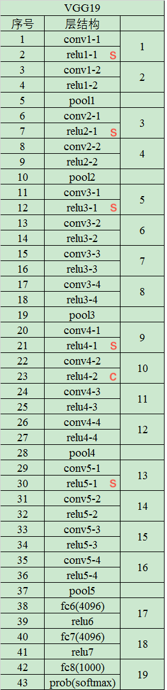

# 神经风格迁移：综述

对目前的风格迁移算法进行综述（截止2018年3月）

[有关文章、代码、预训练的模型、比较结果](https://github.com/ycjing/Neural-Style-Transfer-Papers)

Gatys等人的工作开辟了一个称为神经风格转移（NST）的新领域，即利用卷积神经网络以不同样式渲染内容图像的过程。

-----  

## 分类

</img>

----

## 1.风格迁移（无神经网络）

- non-photorealistic rendering(NPR)  非真实渲染

- image-based artistic rendering（IB-AR）基于图像的艺术渲染

    ***P. Rosin and J. Collomosse, Image and video-based artistic stylisation. Springer Science & Business Media, 2012, vol. 42.***

    ***J. E. Kyprianidis, J. Collomosse, T. Wang, and T. Isenberg, “State of the ‘art’: A taxonomy of artistic stylization techniques for images and video,” IEEE transactions on visualization and computer graphics, vol. 19, no. 5, pp. 866–885, 2013.***

    ***A. Semmo, T. Isenberg, and J. Do ̈llner, “Neural style transfer: A paradigm shift for image-based artistic rendering?” in Proceedings of the Symposium on Non-Photorealistic Animation and Rendering. ACM, 2017, pp. 5:1–5:13***

#### 主要方法

- Stroke-Based Rendering（SBR）基于笔触的渲染

    只能使用特定风格渲染图片 不灵活

    ***A. Hertzmann, “Painterly rendering with curved brush strokes of multiple sizes,” in Proceedings of the 25th annual conference on Computer graphics and interactive techniques. ACM, 1998, pp. 453– 460.***

- Region-Based Techniques 基于区域的方法

    早期基于区域的 IB-AR 算法利用区域的形状来指导笔画放置，通过这种方式，可以在图像的不同语义重分中生成不同的笔画模式。

    ***A. Kolliopoulos, “Image segmentation for stylized non- photorealistic rendering and animation,” Ph.D. dissertation, Uni- versity of Toronto, 2005.***

    ***B. Gooch, G. Coombe, and P. Shirley, “Artistic vision: painterly rendering using computer vision techniques,” in Proceedings of the 2nd international symposium on Non-photorealistic animation and rendering. ACM, 2002, pp. 83–ff.***

    song等人进一步提出了一种基于区域的IB-AR算法，以操纵几何艺术风格。他们的算法通过用多个规范形状替换区域来创建简化的形状渲染效果。

    ***Y.-Z. Song, P. L. Rosin, P. M. Hall, and J. Collomosse, “Arty shapes,” in Proceedings of the Fourth Eurographics conference on Computational Aesthetics in Graphics, Visualization and Imaging. Eurographics Association, 2008, pp. 65–72.***

    依然无法模拟任意样式。

- Example-Based Rendering 基于样例的渲染

    图像类比旨在以监督学习的方式学习一对未经风格迁移的原图像和相关的经过风格迁移的图像。训练集包括一对未风格化的源图像和具有特定样式的风格化后的图像。

    在训练过程中，学习类似变换，并在给定测试输入照片时创建类似的程式化结果。

    ***A. Hertzmann, C. E. Jacobs, N. Oliver, B. Curless, and D. H. Salesin, “Image analogies,” in Proceedings of the 28th annual confer- ence on Computer graphics and interactive techniques. ACM, 2001, pp. 327–340.***

    仅利用低级图像特征，无法有效地捕获内容和样式。

- Image Processing and Filtering 图像处理与滤波

    利用双边滤波和高斯滤波产生卡通效果

    ***H. Winnemo ̈ller, S. C. Olsen, and B. Gooch, “Real-time video abstraction,” in ACM Transactions On Graphics (TOG), vol. 25, no. 3. ACM, 2006, pp. 1221–1226.***

    ***C. Tomasi and R. Manduchi, “Bilateral filtering for gray and color images,” in Proceedings of the IEEE International Conference on Computer Vision. IEEE, 1998, pp. 839–846.***

    ***B. Gooch, E. Reinhard, and A. Gooch, “Human facial illustrations: Creation and psychophysical evaluation,” ACM Transactions on Graphics, vol. 23, no. 1, pp. 27–44, 2004.***

    更易实现、性能高效、而在多样性方面比较有限。

### 综上

    基于上述讨论，虽然一些没有CNN的IB-AR算法能够忠实地描述某些规定的样式，

    但它们在灵活性、样式多样性和有效的图像结构提取方面通常有局限性。

    因此，需要新的算法来解决这些限制，从而产生了NST领域。

----

## 2.神经网络风格迁移前导 DERIVATIONS OF NEURAL STYLE TRANSFER

#### 如何对图像进行建模和风格提取       

风格与纹理非常相关，故可以借鉴视觉纹理建模。

```
风格（style）与纹理（texture）的概念非常相关，然而并不限于纹理。

风格还涉及大量的简化和图形抽象。（纹理特征的合成或对齐）
```

***L.-Y. Wei, S. Lefebvre, V. Kwatra, and G. Turk, “State of the art in example-based texture synthesis,” in Eurographics 2009, State of the Art Report, EG-STAR. Eurographics Association, 2009, pp. 93–117.***

***A. A. Efros and T. K. Leung, “Texture synthesis by non- parametric sampling,” in Proceedings of the IEEE International Conference on Computer Vision, vol. 2. IEEE, 1999, pp. 1033–1038.***

***L.-Y. Wei and M. Levoy, “Fast texture synthesis using tree- structured vector quantization,” in Proceedings of the 27th annual conference on Computer graphics and interactive techniques. ACM Press/Addison-Wesley Publishing Co., 2000, pp. 479–488.***

    有两种不同的方法来建模视觉纹理

- 摘要统计进行参数纹理建模
    + gram-based 基于矩阵(卷积网络)
        * 获取纹理的矩阵表示的方法
        </img>

            - $\cal{F}^l(\mit{I}_s)$ 是在预训练的网络中第 $l$ 层的 feature map（特征图）

            - $\cal{F}^l(\mit{I}_s)^{'}$ 是 $\cal{F}^l(\mit{I}_s)$ 降维之后的表示 (C * W * H) =>(C * (W*H))

            Gatys 提出的一种较新的参数纹理建模方法，是首次使用CNN测量汇总统计数据的方法（VGG）。

            统计全局的数据，然而对于长距离对称数据的识别效果不好。     

        ***L. A. Gatys, A. S. Ecker, and M. Bethge, “Texture synthesis using convolutional neural networks,” in Advances in Neural Information Processing Systems, 2015, pp. 262–270.***

        ***K. Simonyan and A. Zisserman, “Very deep convolutional networks for large-scale image recognition,” arXiv preprint arXiv:1409.1556, 2014.***

        为了解决之前的问题，Berger 和 Memisevic 水平和垂直地转换feature map，
        即将(i,j)、(i+x,j)、(i,j+x)相关联，从而包含空间排列信息，因此在对具有对称属性的纹理建模时更为有效。

        ***G. Berger and R. Memisevic, “Incorporating long-range consis- tency in cnn-based texture generation,” in International Conference on Learning Representations, 2017.***

- 马尔科夫随机场 （MRFs） 进行非参数纹理建模。
    + 其他值得注意的纹理建模方法是使用非参数重采样。各种非参数方法都基于 MRFs 模型，该模型假定在纹理图像中，每个像素完全以其空间邻域为特征。


#### 如何在保留内容的同时重建具有所需风格信息的图像

通常，许多视觉任务的基本步骤是从输入图像中提取抽象表示形式。
图像重建是一个反向过程，就是从提取的图像表示法中重建整个输入图像。

已经有一些特定的图像表示形式，并从抽象表示形式中分析出包含哪些信息。
在这里，我们主要关注基于 CNN 表示的图像重建算法，这些算法可分为基于图像优化的在线图像重建 （Image-Optimisation-Based Online Image Reconstruction  IOB-IR） 和基于模型优化的离线图像重建 （Model-Optimisation- Based Offline Image Reconstruction  MOB-IR）。

- 基于图像优化的在线图像重建 IOB-IR
    + 反转CNN
        * 从随机噪声开始，在图像空间中使用算法迭代优化，直到它在相关的期望上收敛，因此该过程是耗时的。

        ***A. Mahendran and A. Vedaldi, “Understanding deep image representations by inverting them,” in Proceedings of the IEEE Conference on Computer Vision and Pattern Recognition, 2015, pp. 5188–5196.***

        ***——, “Visualizing deep convolutional neural networks using natural pre-images,” International Journal of Computer Vision, vol. 120, no. 3, pp. 233–255, 2016.***


- 基于模型优化的离线图像重建 MOB-IR
    + 预训练的前馈网络
        为了解决效率问题，Dosovitskiy和Brox提出提前训练前馈网络并将计算负担置于训练阶段。 在测试阶段，可以通过网络前向传递简单地完成相反的过程。他们的算法显着加快了图像重建过程。

        ***A. Dosovitskiy and T. Brox, “Inverting visual representations with convolutional networks,” in Proceedings of the IEEE Confer- ence on Computer Vision and Pattern Recognition, 2016, pp. 4829– 4837.***

        在他们后来的工作中，他们使用了对抗网络（GAN）来改进结果。

        ***——, “Generating images with perceptual similarity metrics based on deep networks,” in Advances in Neural Information Processing Systems, 2016, pp. 658–666.***

        ***I. Goodfellow, J. Pouget-Abadie, M. Mirza, B. Xu, D. Warde- Farley, S. Ozair, A. Courville, and Y. Bengio, “Generative adver- sarial nets,” in Advances in neural information processing systems, 2014, pp. 2672–2680.***

---

## 3.神经网络风格迁移算法的分类 （A TAXONOMY OF NEURAL STYLE TRANSFER ALGORITHMS）

在这里，我们尝试以更加结构化的方式评估这些算法，只关注细节，语义，深度和笔触的变化

#### NST算法分为：

###### Image-Optimisation-Based Online Neural Methods

DeepDream is the first attempt to produce artistic images by reversing CNN representations with IOB-IR techniques.

DeepDream 是第一个尝试通过使用 IOB-IR（Image-Optimisation-Based Online Image Reconstruction） 技术反转CNN来产生艺术图像的。

***A. Mordvintsev, C. Olah, and M. Tyka, “Incep- tionism: Going deeper into neural networks,” 2015. [Online]. Available: https://research.googleblog.com/2015/06/ inceptionism- going- deeper- into- neural.html***

通过进一步将视觉纹理建模技术与模型风格相结合，随后提出了IOB-NST算法，为NST领域奠定了早期基础。

- 基本思想  

```
首先从相应的样式和内容图像中建模和提取样式和内容信息，将它们重新组合为目标表示，
然后迭代地重建与目标表示匹配的程式化结果。
```

通常，不同的IOB-NST算法共享相同的IOB-IR技术，但它们对视觉样式进行建模的方式不同，视觉样式建立在前面提到的两类视觉纹理建模技术之上。

IOB-NST算法的共同缺陷是由于迭代图像优化过程，它们在计算上是耗时的。


1. 具有摘要统计的参数神经方法（Parametric Neural Methods with Summary Statistics
）

    - Gatys等人：

        ## ***[4] L. A. Gatys, A. S. Ecker, and M. Bethge, “Image style transfer using convolutional neural networks,” in Proceedings of the IEEE Conference on Computer Vision and Pattern Recognition, 2016, pp. 2414–2423.***

        ***L. A. Gatys, A. S. Ecker, and M. Bethge, “A neural algorithm of artistic style,” ArXiv e-prints, Aug. 2015.***

        通过重建VGG-19网络中间层，Gatys等人观察到深度卷积神经网络能够从任意照片中提取内容，并且可以从著名艺术品中提取图像的一些外观信息。

        根据此，他们构建了一个惩罚算法来通过从 内容和风格化图片中高级抽象部分的不同 来构建新的风格图片的内容组件。

        并且通过匹配 基于矩阵的风格摘要统计信息 和 风格化的图片 来构造风格组件。

        这些摘要统计信息源自他们提出的纹理建模技术

        ***L. A. Gatys, A. S. Ecker, and M. Bethge, “Texture synthesis using convolutional neural networks,” in Advances in Neural Information Processing Systems, 2015, pp. 262–270.***

        - 方法细节

            给定一个内容图 $I_c$ 和一个风格图 $I_s$ ，[4]中的算法试图去寻找一个风格化的图像 $I$ 以符合以下要求：

            ## $I^* = arg_{I} min \cal {L}_{total} (\mit{I}_c, I_s, I)$

            ## $=arg_{I} min {\alpha} \cal{L}_c(\mit{I}_c, I) + {\beta} {\cal{L}}_{s} (\mit{I}_s, I)$


            * 其中 $\cal{L}_c$ 是比较 给定内容图 和 风格化图片 的内容

                + 损失函数 $\cal{L}_c$ 定义：

                    ##### $\cal{L}_c = \sum_{l \in {\{l_c\}}} || \cal{F}^l(\mit{I}_c)-\cal{F}^l(\mit{I})||^\tt2$

                    - $\{l_c\}$ 表示用来计算损失的 VGG 网络的层的集合

                    - 实际上 是在卷积网络VGG 第 $l$ 层的内容图的特征表示 $I_c$ 和由随机噪声初始化而来并迭代优化的风格化图片 $I$ 之间的欧式距离


            * $\cal{L}_s$ 是比较 给定风格图中 和 风格化图片中 导出的风格的矩阵表示。   

                + 损失函数 $\cal{L}_s$ 定义：

                    ##### $\cal{L_s} = \sum_{l \in {\{l_s\}}} || \cal{G}( \cal{F}^l(\mit{I}_s)^{'})-\cal{G}(\cal{F}^l(\mit{I})^{'})||^\tt2$

                    - $\cal{G}$ : Gram-based representation 纹理的矩阵表示 也是用于对滤波后的二阶统计数据（矩阵）进行编码（处理）的结果

                    - $\{l_s\}$ 表示用来计算损失的 VGG 网络的层的集合

                    - 实际上 是在卷积网络VGG 第 $l$ 层的风格图的风格表示（矩阵） $I_c$ 和由随机噪声初始化而来并迭代优化的 风格化图片 $I$ 的风格表示（矩阵）之间的欧式距离


            * $\alpha$ 和 $\beta$ 则是用来平衡 风格化图片中的 内容组建和风格组件。


            * 内容和风格的 `层` 的选择是至关重要的，网络中不同的位置和数量的层将会导致截然不同的结果的出现。

            

            ***VGG起源: K. Simonyan and A. Zisserman, “Very deep convolutional networks for large-scale image recognition,” arXiv preprint arXiv:1409.1556, 2014.***

            ***[4] L. A. Gatys, A. S. Ecker, and M. Bethge, “Image style transfer using convolutional neural networks,” in Proceedings of the IEEE Conference on Computer Vision and Pattern Recognition, 2016, pp. 2414–2423.***

            对于 $l_s$ ，匹配多尺度样式表示可以实现更平滑，更连续的样式，从而获得最具吸引力的视觉效果。

            对于 $l_c$ ，匹配较低层上的内容，可以在风格化过程中保持原始图像比较精细的，但却是不被需要的结构信息（边缘信息和颜色信息）。相反，通过匹配网络的较高层上的内容，可以改变较为精细的结构部分，在保留内容图像的内容信息的同时迎合期望的风格。

            匹配较低层上的内容表示在风格化期间保留原始内容图像的不期望的精细结构（例如，边缘和颜色图）。相反，通过匹配网络的较高层上的内容，可以改变精细结构 在保留内容图像的内容信息的同时同意期望的样式。

            此外，使用基于VGG的丢失网络进行样式传输并不是唯一的选择。 通过选择其他预训练的分类网络，例如ResNet：  

            ***K. He, X. Zhang, S. Ren, and J. Sun, “Deep residual learning for image recognition,” in Proceedings of the IEEE conference on computer vision and pattern recognition, 2016, pp. 770–778.***


2. 基于马尔可夫随机场的非参数神经方法（Non-parametric Neural Methods with MRFs）


###### Model-Optimisation-Based Offline Neural Methods


#### 基于非真实渲染的2D图像NST算法


---


## 测量方法与比较

#
