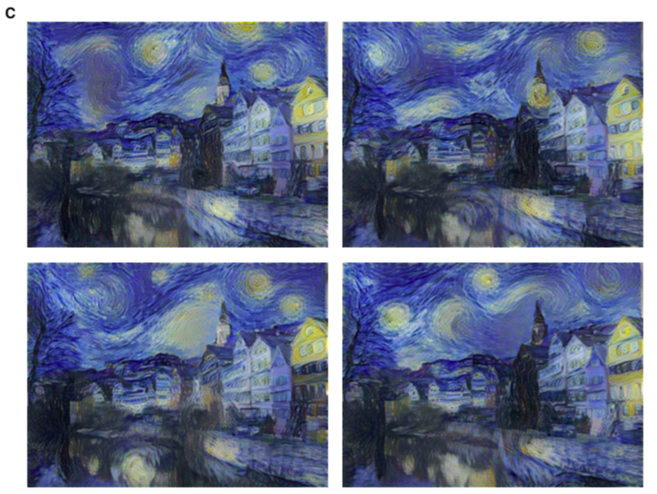

# 使用卷积网络进行图片的风格迁移

Image Style Transfer Using Convolutional Neural Networks

- Leon A. Gatys（Alexander S. Ecker、Matthias Bethge）德国图宾根大学 2016 CVF

## 简述

之前的风格迁移算法并没有相关的参数算法（使用神经网络）

所以虽然这些方法取得了不错的效果，但是他们都收到相同的基本的限制：他们仅使用目标图像的低级图像特征来进行纹理迁移。


理想情况下，风格转移算法应该能够从目标图像（例如，对象和一般风景）中提取语义图像内容，然后通知纹理转移进程去以源图像的风格来渲染目标图的语义信息。


神经网络可以胜任提取图像高级语义信息、以及图像风格的工作。

</img>

- 内容重建

    网络的高层特征一般是关于输入图像的物体和布局等信息，低层特征一般表达输入图像的像素信息。也就是说在提取content特征时，不同层的表达效果是不一样的。

    从CNN的较低层（a-c）进行内容的重建是最好的，因为在较高层的网络中，虽然图像保存了高级内容信息，但是同时也丢失了较为精细的内容信息。


- 风格重建

    在网络层数递增的过程中，图像与原来风格图像越来越匹配，同时也逐渐丢失给定的空间信息。

    不同层的特征表达有不同的视觉效果，因此在后面提取style feature map的时候采用的是多层特征的融合，这样风格表达会更加丰富。


## 算法核心


```
为什么会引入Gram矩阵呢？

其实就是为了表达图像的纹理特征（content representation）。

有一种说法是图像的纹理特征和位置是没有关系的，
Gram矩阵这种求两个feature map内积的结果也是和位置没有关系的，
因此可以用来度量纹理特征。

后来看的一些图像风格迁移的文章也挺多是对如何描述纹理相似方面入手。
```


x的每一层的Gl都会和a的每一层的Al一起计算均方差EL，然后由这个EL根据权重w计算得到Lstyle（如Figure2最下面的左边公式），权重w用来表达各层特征的重要性，这个损失就是用来描述风格的差异。

- Style loss

            

            
    .
        

    + 这里的 $l$ 表示层，i 和 j 表示该层的第i个feature map和第j个feature map，k表示feature map的第k个元素，因此这个公式就是对两个feature map求内积。

    + $G^l$ style features，根据 $F^l$ 利用 Gram矩阵 计算得到的。

    l层的激活函数对应的 $E_l$ 的偏导数计算如下
    


- Content loss

    content的loss的计算公式如下图：

    

    x的 conv4层 的 $F^l$ 和p的 conv4 的 $P^l$ 计算均方差 $L_{content}$ ，就是content的loss。

    损失函数的偏导数对应的l层的激活函数为：

    


- $F^l$ content fetures,每个卷积层的feature map.

- $P^l$ 经过多个卷积和pool层，每层都会生成很多feature map，用$P^l$表示，并称之为content representation


<!--  -->
最下面是关于x的更新公式，其实就是对总的loss求导，然后乘以步长，得到的就是更新的大小。

因此x就不断的在中间这个网络中循环更新，直到达到好的效果。

总的损失函数


## $\frac{\alpha}{\beta}$
从左上方到右下方增加


## 初始化图片

在文中是采用随机生成一个白噪声图像来初始化的

在文中作者也对比了其他初始化方法，比如用style image初始化或用content image进行初始化，结果表明不同的初始化方式对最终的结果没有太大的影响。

每次随机初始化都会生成不同的结果，如下图中的C有4张。




但是用style image或content image初始化生成的结果是固定的。


A: Initialised from content image   
B: Initialised from style image

上述所有图的 $\alpha / \beta = 1 * 10^{-3}$


## 照片之间的风格迁移也可以

将夜间纽约的照片样式转换为白天的伦敦图像


## 图片表示

本文使用规范化的VGG-19的16个卷积层和5个池化层提取出的特征空间

通过缩放权重进行网络的归一化，以使每个卷积滤波器在图像和位置上的平均激活次数等于1。这种缩放可以在不更改VGG网络输出的情况下完成，因为VGG只包含了ReLU激活函数（rectifying linear activation functions），并没有对特征图进行规范化或合并。


没有使用全连接层。模型公开（caffe）

在图像合成过程中，使用平均池化代替最大值池化。

两张图片在提取特征之前都会resize到相同尺寸。


## 总结

- 缺点：

    + 时间太慢
    + 合成图像有时会受到一些低级噪声的影响
