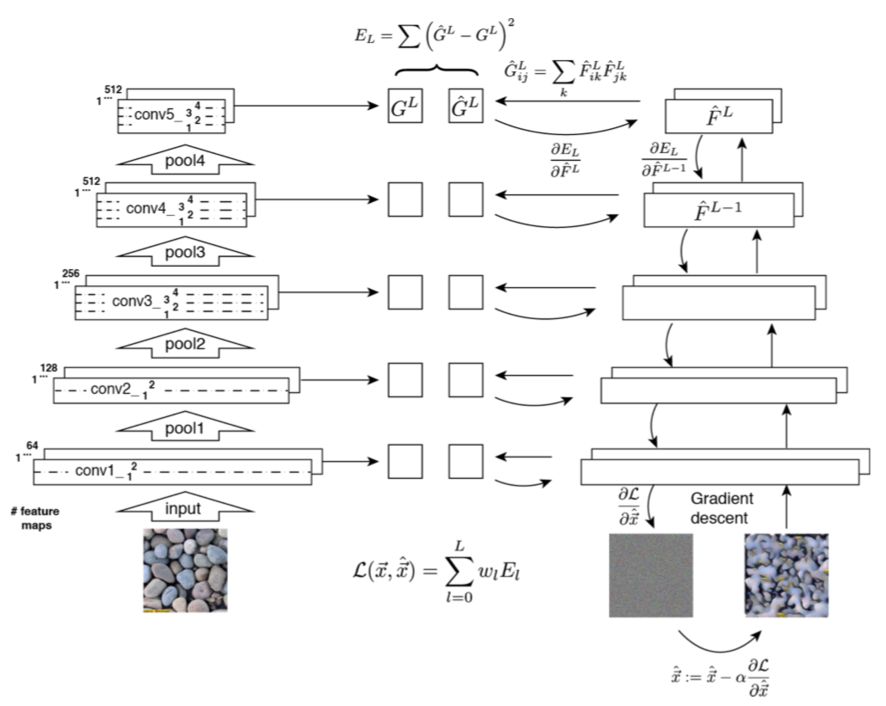

# Texture Synthesis Using Convolutional Neural Networks

卷积神经网络的纹理合成

- Leon A. Gatys（Alexander S. Ecker、Matthias Bethge）德国图宾根大学 2015

## 算法核心

合成方法：

- 纹理分析

    原始纹理传入 CNN，一定层的一些特征相应的 Gram矩阵  $G_l$

- 纹理合成

    白噪音图像 x 传入CNN，计算包涵纹理模型的每个层的损失函数 $E_l$。

    在每个像素值的总损失函数上计算题度下降，生成与原始纹理相同的 Gram矩阵， 从而得到一个新图像。

## CNN

[源码](https://github.com/leongatys/DeepTextures)

- VGG-19

    使用了VGG-19网络的16个卷积层和5个池化层的特征空间。

    没有使用全连接层。

    - 滤波其大小为 $3*3*k$ 的线性修正卷积，其中 k 是输入特征图的数量。

    - 卷积的步长和 padding = 1，以保证输出特征图和输入特征图保持相同的空间维度。

    - 不重叠的2×2的最大池化层，用来对特征图进行下采样。

    - 将所有的最大池化换成了平均值池化。
