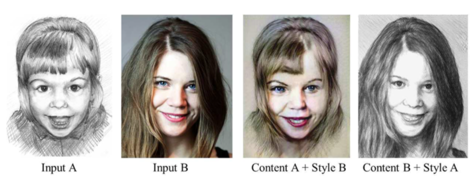
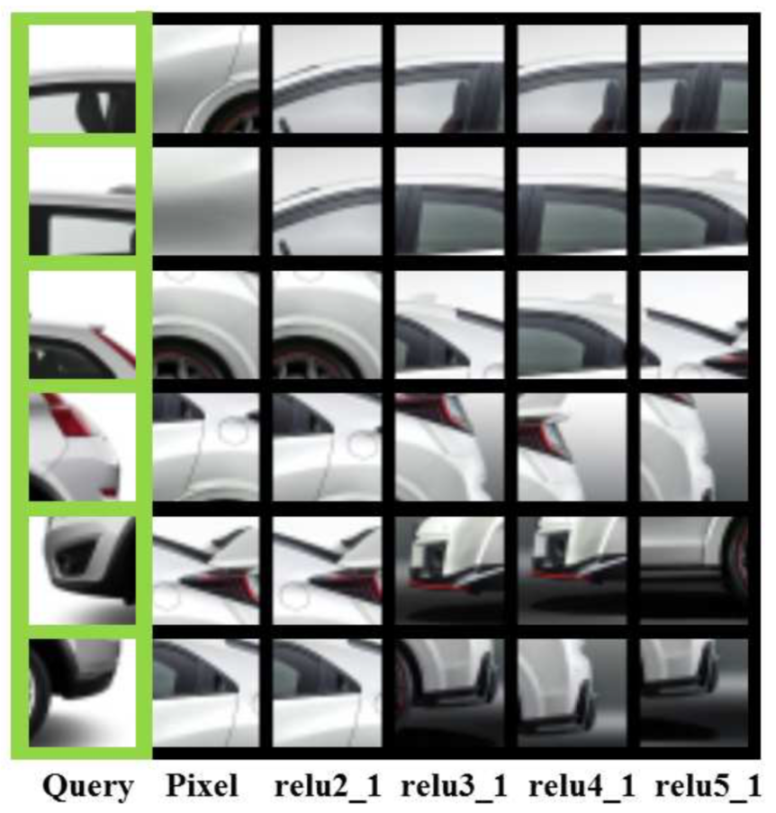
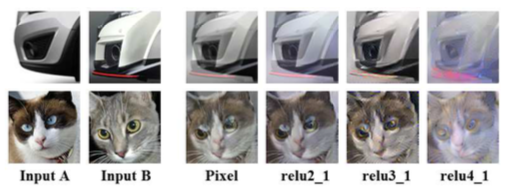

# 结合马尔可夫随机场和卷积神经网络进行图像合成

Combining Markov Random Fields and Convolutional Neural Networks for Image Synthesis

- Chuan Li & Michael Wand 美因茨大学 2016 cvpr

## 相关工作

- 基于神经网络的图像合成

    + GAN（generative adversarial networks）

        进一步的方法是生成对抗网络的框架。在这里，两个网络（一个作为鉴别器，另一个作为生成器）通过玩minnimax游戏来互相改善。最后，与纯图像合成相比，生成器能够生成更多自然图像。

        ***GAN：I. Goodfellow, J. Pouget-Abadie, M. Mirza, B. Xu, D. Warde-Farley, S. Ozair, A. Courville, and Y. Bengio. Generative adversarial nets. In Advances in Neural Information Processing Systems (NIPS) 27, pages 2672–2680. 2014. 3***

        人脸：

        ***E. L. Denton, R. Fergus, A. Szlam, and S. Chintala. Deep generative image models using a laplacian pyramid of adver- sarial networks. In Advances in Neural Information Process- ing Systems (NIPS) 28, 2015. 2, 3***

- 基于 MRF 的图像合成

    + 局部纹理合理，全局纹理混乱

## 模型核心

### 原理

我们假设给定一个

- 样式图像： $X_s \in \mathbb{R}^{w_s \times h_s}$

- 内容图像： $X_c \in \mathbb{R}^{w_c \times h_c}$

求：

- 合成图像： $X \in \mathbb{R}^{w_c \times h_c}$

通过

- 使 $X$ 的高级神经编码相近于 $X_c$

- 同时使 $X$ 的局部补丁（patches）近似于 $X_s$ 得局部补丁

将 $X_s$ 的样式转移到 $X_c$ 的布局之中。

### 算法公式

#### $X = arg_x min E_s(Φ(X),Φ(X_s)) + \alpha_1E_c(Φ(X),Φ(X_c)) + \alpha_2Υ(X)$

- $E_s$ : 样式损失函数（MRFs 限制）

    + $Φ(X)$ : 是网络中某些层的 $X$ 的特征图

- $E_c$ : 内容损失函数，它计算合成图像 $X$ 和内容图像 $X_c$ 之间特征图的平方差

- $Υ(X)$ : 添加项为图像重建过程中的平滑先验。

#### 细节

- MRFs loss function（style loss function）:

    #####$E_s(Φ(X),Φ(X_s))=\sum^{m}_{i=1}||Ψ_i(Φ(X))-Ψ_{NN(i)}(Φ(X_s))||^2$

    + $Φ(X)$ 表示 $X$ 的一组特定的特征图

    + $Ψ(Φ(X))$ 表示从 $Φ(X)$ 中提取的一组局部补丁，每一个补丁被记做 $Ψ_i(Φ(X))$ ，大小为 $k \times k \times C$ ， k 是补丁的宽高，C 是patch提取层的特征图的通道数

    + $m$ 是 $Ψ(Φ(X))$ 的基数。

    + 对每个 $Ψ_i(Φ(X))$ ，我们都利用NCC（归一化互相关）在 $m_s$ 个风格补丁 （ $Ψ(Φ(X_s))$ ）中找到和它最匹配的补丁 $Ψ_{NN(i)}(Φ(X_s))$

    +  归一化互相关：

        ##### $NN(i) := arg_{j=1,...,m_s} min \frac{Ψ_i(Φ(X))·Ψ_j(Φ(X_s))}{|Ψ_i(Φ(X))|·|Ψ_j(Φ(X_s))|}$

    + 虽然使用了 NCC ，但是还是使用了欧式距离来使合成图片的过程中风格更加贴近于被选择的风格

- Content loss function:

    ##### $E_c(Φ(X), Φ(X_c)) = ||Φ(X) − Φ(X_c)||^2$

    + $E_c$ 通过最小化 $Φ(X)$ 与 $Φ(X_c)$ 之间欧式距离的平方的方式指引合成图片的内容

- Regularizer: 正则项：

    因为在网络训练过程中，有很多低级的像素特征被丢弃，导致可能生成嘈杂且不自然的图像，所以添加正则化项来在图像合成过程中进行平滑。

     ##### $Υ(x)=\sum_{i,j}((x_{i,j+1} − x_{i,j})^2 +(x_{i+1,j} − x_{i,j})^2)$

- 权重：

    - 内容权重

        $\alpha_1$ 默认为 1，用户可微调此值。

    - 正则项权重

        $\alpha_2$ 一般固定为 0.001

- 最优化过程：

    使用限制内存的 BFGS（一种拟牛顿最优化算法）在对公式

    $X = arg_x min E_s(Φ(X),Φ(X_s)) + \alpha_1E_c(Φ(X),Φ(X_c)) + \alpha_2Υ(X)$

    进行最优化时，进行反向传播更新网络权重。

    + 特别需要注意的是：也是本文重要的地方是：

        $E_s$相对于特征图的梯度，是 $Φ(X)$ 与基于 MRFs 进行重构的使用 $Φ(X_s)$ 的补丁之间逐元素之间的差异。

        这种重建本质上是一个使用神经补丁而不是使用像素补丁的纹理优化过程。

        在神经水平上优化此 MRFs 是非常重要的，因为传统的基于像素的纹理优化将无法产生相同质量的结果。

----

## 实验过程

### 匹配

匹配两个不同的汽车图像。

第一列包含来自一辆汽车的查询补丁；每列均显示在不同的特征图（包括像素层）中找到的另一辆汽车的最佳匹配。

在relu3_1和relu4_1层 结果更好

我们在relu3_1和relu4_1层使用神经补丁作为 MRF 来限制合成过程中的风格合成方面。

### 合成

比较两组混合结果：

第一种方法是直接混合两个输入色块的像素。

第二种方法是将这些补丁通过网络传递，并在不同层混合它们的神经激活。

所选择的图片在语义上相关并且在结构上相似，但是像素值显着不同。

对像素层进行平均通常会产生强烈的重影伪影；混合神经补丁通常比直接融合像素补丁更好。

较低的层（例如relu2 1）的行为类似于像素；

中间层（relu3 1和relu4 1）通常会提供更有意义的混合；

从relu4 1以外的层进行重建往往太模糊而无法用于合成。

---

## limitation

- 输入数据受限

    仅当内容图像可以由样式图像中的MRF重新组合时，它才起作用。例如，强透视图或结构差异的图像不适合我们的方法。

    通常，我们的方法对于允许结构变形的对象（例如人脸和汽车）效果更好。对于具有严格对称性的主题（例如建筑），通常我们的方法会生成结构伪像。

- 清晰度

# eof
