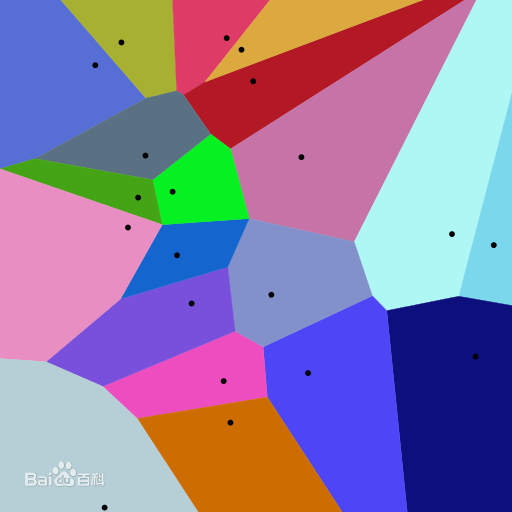
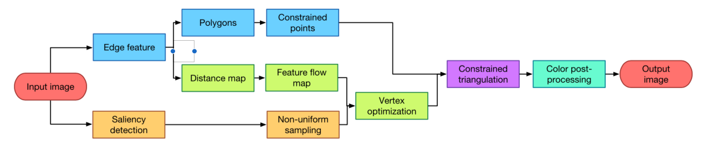
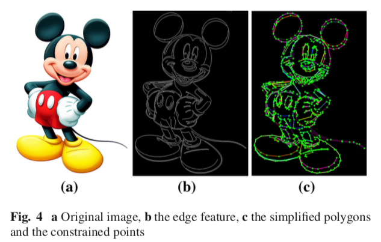

# 低聚风格的风格迁移

图像处理方法

速度很快

## Voronoi 图

## 流程图

- 输入图像首先由边缘检测器处理，跟踪的边缘通过多边形曲线近似，在最终的Delaunay三角剖分步骤中，多边形的边缘将成为约束边缘

- 特征边缘还用于计算距离图以生成特征流场。该字段将指导网格中顶点的排列

- 同时，也可以使用显着性检测过程来引导前对象和背景之间的不均匀采样

- 然后，我们使用由特征流场加权的质心Voronoi图优化采样点

- 在对Lloyd张弛算法进行一些迭代之后，将样本点与上一步中的约束点一起添加到约束Delaunay三角剖分中。

- 最后，我们在三角形中选择颜色，并进行其他颜色后处理以生成最终结果

